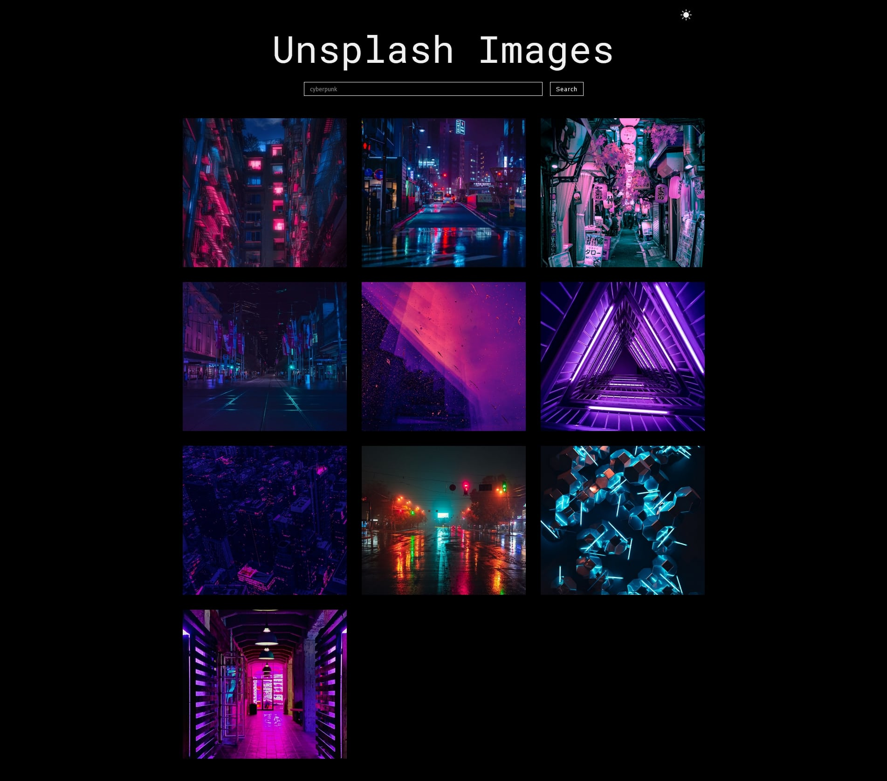

# Stock Photos

## Built with

- React.js
- Axios
- React Query
- useEffect
- useState
- External APIs
- CSS
- React Icons
- Global Context

## Users should be able to:

- Type in a search form to look for images they need
- Browse through the images returned by the search and see them displayed in a grid
- Get an error message if the search didn't return any results or if there was a problem with the API request
- toggle between light and dark themes
- Enjoy a fast and responsive user experience thanks to the efficient use of React and external APIs.

## Links

- Live Site URL: [Stock Photos](https://reliable-dango-e3cec9.netlify.app/)
